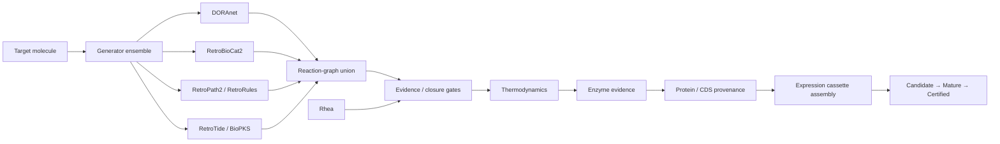

# SynBioCrow 2.1.0

**SynBioCrow** is a computational synthetic-biology design framework for moving from a target molecule to evidence-aware biosynthetic pathway candidates and provenance-backed DNA construct candidates.

Version **2.1.0** consolidates the current SynBioCrow architecture, adds bounded **BioPKS / RetroTide** specialization, preserves the frozen Paper-1 baseline, and keeps a strict distinction between generated candidates and scientifically supported or certified results.

> **Release status:** SynBioCrow 2.1.0 is a computational research release. Candidate pathways and constructs are **not experimental certifications**.

---

## What SynBioCrow does

SynBioCrow combines multiple complementary pathway-generation and evidence systems rather than relying on a single retrosynthesis engine.



The central design principle is that **generation and validation are separate**. A backend can propose chemistry, but it cannot promote its own output through the scientific lifecycle.

---

## Engine roles

| Component | Role in SynBioCrow 2.1 |
|---|---|
| **DORAnet** | General biosynthetic reaction-network generation |
| **RetroBioCat2** | Enzyme-centered biocatalytic retrosynthesis |
| **RetroPath2 / RetroRules** | Rule-based pathway generation and reaction-space expansion |
| **RetroTide** | Bounded specialized PKS design |
| **BioPKS** | PKS + post-PKS biological transformation workflow |
| **Rhea** | Reaction evidence / closure support — **not counted as an independent generator** |
| **DORA-XGB** | Reaction-feasibility scoring within the BioPKS branch |
| **UniProt / RefSeq** | Protein and CDS provenance resolution |
| **iGEM Registry / SBOL resources** | Provenance-backed expression-part acquisition |

SynBioCrow can combine independent generator outputs at the **reaction-graph level**, which is intended to recover pathways that no single engine can necessarily recover on its own.

---

## Scientific lifecycle

SynBioCrow deliberately keeps three states separate:

### Candidate
A computationally generated route or construct that satisfies the relevant structural/data contract.

### Mature
A Candidate that has passed stronger evidence gates such as reaction support, enzyme evidence, closure, and other required checks.

### Certified
A result that satisfies the full certification contract for the release.

**SynBioCrow never promotes a result merely because a generator produced it or a model assigned it a high score.**

---

## SynBioCrow 2.1.0 scientific state

The sealed 2.1 release retains:

- **19 unique provenance-backed Candidate DNA constructs**
- **6 normalized BioPKS / RetroTide specialized-generator Candidate pathways**
- **0 specialized Mature pathways**
- **0 specialized Certified pathways**
- frozen **Paper-1 / v0.21** baseline
- preserved **benchmark-v2 blind-truth isolation**
- no fabricated chemistry, enzyme evidence, thermodynamics, or biological sequences

### BioPKS / RetroTide result

The specialized PKS branch is now operational and integrated into the normal SynBioCrow evidence lifecycle.

The leading bounded BioPKS candidate uses `rule0024_21`:

```text
O=C(O)C(O)Cc1ccccc1  →  O=C=O + OCCc1ccccc1
```

The pathway is stoichiometrically closed and computationally feasible, but it remains:

**CANDIDATE / NOT_CERTIFIED**

because the following are still unresolved for the exact transformation:

- direct independent reaction evidence
- verified enzyme identity
- quantitative thermodynamics

This is recorded explicitly in `specialized_generator_abstention_ledger.json`.

---

## Stable Python release API

SynBioCrow 2.1 includes a small read-only API for inspecting the sealed release state.

```python
from synbiocrow import SynBioCrowRelease

release = SynBioCrowRelease(".")

print(release.status())
print(release.policies())
print(release.specialized_summary())
```

The API validates the frozen release contract when it loads and raises an error if required release invariants have drifted.

### Install the release-state package

From the repository root:

```bash
pip install -e .
```

Then:

```python
from synbiocrow import SynBioCrowRelease

r = SynBioCrowRelease(".")
print(r.status())
```

> The lightweight `synbiocrow/` package in this repository is the **stable release-state/API surface**. Generator backends such as DORAnet, RetroBioCat2, RetroPath2, RetroTide, and BioPKS remain separate upstream scientific dependencies and are not vendored into this repository.

---

## Repository layout

```text
SynBioCrow/
├── synbiocrow/                         # stable 2.1 release API
├── docs/
│   ├── API.md
│   ├── ARCHITECTURE.md
│   ├── LIMITATIONS.md
│   └── REPRODUCIBILITY.md
├── release_manifest.json
├── release_readiness_manifest.json
├── ensemble_release_handoff.json
├── integrated_regression.json
├── specialized_generator_abstention_ledger.json
├── RELEASE_NOTES.md
├── pyproject.toml
└── historical notebooks/scripts       # retained for development provenance
```

The earlier notebook-era SynBioCrow files remain in the repository intentionally. They document the project's development history, but the **2.1 release API and manifests are the current release surface**.

---

## Frozen release policies

SynBioCrow 2.1.0 preserves the following contracts:

- Paper-1 baseline remains frozen and unmodified
- benchmark-v2 truth is not accessed during release development
- Candidate / Mature / Certified states remain separate
- specialized generators default to Candidate
- Rhea is evidence/closure infrastructure rather than an independent generator
- missing chemistry, enzyme evidence, cofactors, thermodynamics, kinetics, or sequences are not fabricated
- evidence abstentions are preserved rather than converted into positive claims

---

## Reproducibility

The final release was promoted from the sealed 2.1 RC lineage without rerunning the scientific search.

The release package records:

- scientific state and counts
- frozen-policy assertions
- integrated regression results
- specialized-generator abstention provenance
- source-lineage metadata
- SHA-256 provenance fields

See:

- [Reproducibility](docs/REPRODUCIBILITY.md)
- [Release manifest](release_manifest.json)
- [Integrated regression](integrated_regression.json)

---

## Limitations

SynBioCrow 2.1 is a computational research system.

It does **not** claim that a Candidate:

- expresses successfully in a chosen chassis
- has experimentally validated enzyme activity
- produces useful metabolic flux
- is nontoxic
- is manufacturable
- is experimentally viable
- has been laboratory certified

See [docs/LIMITATIONS.md](docs/LIMITATIONS.md) for the release-level limitations.

---

## Documentation

- [Architecture](docs/ARCHITECTURE.md)
- [API](docs/API.md)
- [Limitations](docs/LIMITATIONS.md)
- [Reproducibility](docs/REPRODUCIBILITY.md)
- [Release notes](RELEASE_NOTES.md)

---

## Historical development

SynBioCrow began as a notebook-driven retrosynthesis / bioretrosynthesis project and evolved into an ensemble framework with explicit scientific lifecycle contracts, provenance-backed sequence resolution, construct assembly, and specialized PKS integration.

The historical notebooks and scripts are intentionally retained so earlier work is not erased as the project becomes more modular and reproducible.

---

## Citation

A formal SynBioCrow paper/citation is still being prepared.

For now, when referring specifically to this repository, please cite:

**SynBioCrow 2.1.0 — computational synthetic-biology pathway and construct design framework.**

The eventual publication citation and DOI can replace this section when the manuscript/repository archive is finalized.

---

## Release

Current release: **SynBioCrow 2.1.0**

Suggested Git tag: **`v2.1.0`**

See [RELEASE_NOTES.md](RELEASE_NOTES.md) for the release summary.
