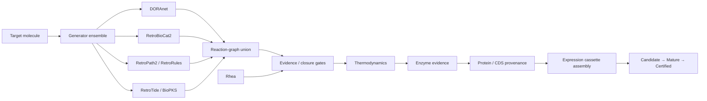

# SynBioCrow 2.1.1

[](https://doi.org/10.5281/zenodo.22999039)

**SynBioCrow** is a computational synthetic-biology design framework for moving from a target molecule to evidence-aware biosynthetic pathway candidates and provenance-backed DNA construct candidates.

**2.1.1 is the archival/repository-maintenance release.** It reorganizes and documents the repository for long-term use and Zenodo archiving. The underlying **scientific payload is unchanged from the sealed 2.1.0 release**.

> **Release status:** computational research release. Candidate pathways and constructs are **not experimental certifications**.

## What SynBioCrow does

SynBioCrow combines multiple complementary pathway-generation and evidence systems rather than relying on a single retrosynthesis engine.



The central design principle is that **generation and validation are separate**. A backend can propose chemistry, but it cannot promote its own output through the scientific lifecycle.

## Engine roles

| Component | Role in SynBioCrow 2.1 |
|---|---|
| **DORAnet** | General biosynthetic reaction-network generation |
| **RetroBioCat2** | Enzyme-centered biocatalytic retrosynthesis |
| **RetroPath2 / RetroRules** | Rule-based pathway generation and reaction-space expansion |
| **RetroTide** | Bounded specialized PKS design |
| **BioPKS** | PKS + post-PKS biological transformation workflow |
| **Rhea** | Reaction evidence / closure support — **not an independent generator** |
| **DORA-XGB** | Reaction-feasibility scoring within the BioPKS branch |
| **UniProt / RefSeq** | Protein and CDS provenance resolution |
| **iGEM Registry / SBOL resources** | Provenance-backed expression-part acquisition |

## Scientific lifecycle

**Candidate** — computationally generated route or construct satisfying the relevant structural/data contract.

**Mature** — Candidate that has passed stronger evidence gates such as reaction support, enzyme evidence, closure, and other required checks.

**Certified** — result satisfying the full certification contract for the release.

**SynBioCrow never promotes a result merely because a generator produced it or a model assigned it a high score.**

## Sealed scientific state

The 2.1 scientific release retains:

- **19 unique provenance-backed Candidate DNA constructs**
- **6 normalized BioPKS / RetroTide specialized-generator Candidate pathways**
- **0 specialized Mature pathways**
- **0 specialized Certified pathways**
- frozen **Paper-1 / v0.21** baseline
- preserved **benchmark-v2 blind-truth isolation**
- no fabricated chemistry, enzyme evidence, thermodynamics, or biological sequences

The leading bounded BioPKS candidate uses `rule0024_21`:

```text
O=C(O)C(O)Cc1ccccc1  →  O=C=O + OCCc1ccccc1
```

It remains **CANDIDATE / NOT_CERTIFIED** because direct independent reaction evidence, verified enzyme identity, and quantitative thermodynamics remain unresolved.

## Stable Python release API

```python
from synbiocrow import SynBioCrowRelease

release = SynBioCrowRelease(".")
print(release.status())
print(release.policies())
print(release.specialized_summary())
```

### Install the release-state package

From the repository root:

```bash
pip install -e .
```

This installs the **SynBioCrow core/release-state package only**. It does **not** install every scientific generator backend. That separation is intentional: several backends have large, specialized, or mutually awkward runtime requirements, and RetroPath2 also depends on external KNIME/data resources.

The active 2.2 development branch includes `SynBioCrowEngine.backend_readiness()` so a runtime can report which backends are installed and configured.

### Scientific backend requirements

| Backend | Current upstream location | Installation / runtime notes |
|---|---|---|
| **DORAnet** | https://github.com/wsprague-nu/doranet | The 2.2 branch provides an optional `doranet==0.5.7a1` extra. Core SynBioCrow does not require it. |
| **RetroBioCat2** | https://github.com/willfinnigan/RetroBioCat-2 | Installed as a separate pinned research runtime. RBC2 carries a substantial scientific dependency/data stack, so it is not forced into the core environment. |
| **RetroPath2 wrapper** | https://github.com/brsynth/retropath2-wrapper | Requires the wrapper plus RDKit and a working KNIME runtime. |
| **rp2paths** | https://github.com/brsynth/rp2paths | Used after RetroPath2 scope generation to enumerate complete pathways. |
| **RetroRules** | https://retrorules.org | Reaction-rule resource used by RetroPath2. The older extractor repository is archived at https://github.com/Galaxy-SynBioCAD/RetroRules. |
| **RetroTide** | https://github.com/JBEI/RetroTide | Specialized PKS backend; the proven SynBioCrow adapter is scheduled for migration into the 2.2 engine after the evidence/construct layers. |
| **KNIME** | https://www.knime.com/ | Required by the current RetroPath2 workflow. |

A practical installation pattern for the 2.2 engine is therefore:

```bash
# SynBioCrow core
pip install -e .

# Optional DORAnet backend
pip install -e ".[doranet]"

# RetroBioCat2 and RetroPath2 are installed/configured in their
# own scientific runtimes according to the upstream projects above.
```

The long-term goal is to expose named optional extras and/or a SynBioCrow bootstrap command for the Python-installable pieces while keeping KNIME, rule corpora, and other large external assets explicit rather than silently downloading them.


## Development roadmap: SynBioCrow 2.2

The current development branch is `develop/2.2-engine-consolidation`.

- **M0 — release preservation and core contracts: complete**
- **M1 — DORAnet, RetroBioCat2, RetroPath2/RetroRules adapters: complete**
- **M2 — reaction-level cross-engine ensemble graph: complete**
- **M3 — evidence and closure:** RetroPath identity resolution, Rhea, thermodynamics, enzyme evidence
- **M4 — sequence + construct design optimization:** select evidence-backed enzyme sequences; preserve protein sequence by default; optimize coding DNA for the chosen chassis; assemble and score expression cassettes
- **M5 — specialized generators:** migrate the proven BioPKS/RetroTide branch into the shared reaction graph
- **M6 — user-facing execution:** public engine API, CLI, Colab runner, backend bootstrap/readiness, persistence/resume
- **M7 — computational Test layer:** integrated regression, reproducibility panel, pathway/construct validation, performance and provenance reports
- **M8 — Learn layer / closed-loop DBTL:** use structured Test outcomes to update ranking, backend selection, route prioritization, and design policies without bypassing evidence gates
- **M9 — SynBioCrow 2.2 release candidate and paper/reproducibility package**

### Where Design–Build–Test–Learn fits

SynBioCrow is already performing the **Design** part: pathway generation, cross-engine graph assembly, evidence-aware route selection, and construct planning.

In **M4**, **Build** becomes explicit as a *digital build*: provenance-backed CDS selection, codon optimization, regulatory-part selection, cassette assembly, and exportable sequence artifacts. This remains computational; it is not a claim that DNA was physically synthesized.

**Test** is split across two levels. M3 tests pathway chemistry/evidence; M7 runs integrated in-silico pathway/construct validation and reproducibility tests.

The explicit **Learn** loop arrives in M8, once Test results have a stable machine-readable contract. At that point SynBioCrow can feed outcomes back into route ranking, generator weighting, sequence/cassette choices, and active-learning priorities while still keeping Candidate/Mature/Certified promotion evidence-gated.

### Sequence optimization policy for M4

M4 will optimize the **nucleotide sequence and expression construct while preserving the selected protein amino-acid sequence by default**. Expected objectives include:

- chassis-aware codon usage
- GC-content control
- removal of forbidden motifs/restriction sites
- repeat/homopolymer avoidance
- translation-initiation/RBS compatibility
- promoter/RBS/terminator and cassette-level balancing
- sequence provenance and deterministic QC

Changing the enzyme's amino-acid sequence is a different problem. Protein engineering can be added later as an explicitly separate optimization mode, with its own structural/functional validation gates; it should not be silently mixed into routine codon optimization.

## Repository layout

```text
SynBioCrow/
├── README.md
├── CITATION.cff
├── LICENSE.txt
├── pyproject.toml
├── RELEASE_NOTES.md
├── synbiocrow/                       # stable release API
├── docs/                             # architecture/API/limitations/reproducibility
├── release/
│   └── 2.1.0/                       # sealed scientific release manifests
└── development_history/
    ├── README.md
    ├── notebooks/                    # early notebook-era development
    └── scripts/                      # early supporting scripts
```

Formal releases are preserved by **Git tags + GitHub Releases + Zenodo**. The `development_history/` directory contains pre-release development lineage and historical artifacts, not current release files.

## Reproducibility

The sealed 2.1.0 scientific state is stored under [release/2.1.0](release/2.1.0/). The 2.1.1 repository update reorganizes those artifacts without changing their scientific content.

- [Reproducibility](docs/REPRODUCIBILITY.md)
- [Release manifest](release/2.1.0/release_manifest.json)
- [Integrated regression](release/2.1.0/integrated_regression.json)
- [Evidence abstention ledger](release/2.1.0/specialized_generator_abstention_ledger.json)

## Limitations

SynBioCrow 2.1 is a computational research system. It does **not** claim that a Candidate expresses successfully, has experimentally validated enzyme activity, produces useful flux, is nontoxic, is manufacturable, or is experimentally certified.

See [docs/LIMITATIONS.md](docs/LIMITATIONS.md).

## Citation

Please cite the archived repository release as:

**Heiman, Thomas J. (2026). SynBioCrow 2.1.1: computational synthetic-biology pathway and construct design framework. Zenodo. https://doi.org/10.5281/zenodo.22999039**

Machine-readable citation metadata is available in [CITATION.cff](CITATION.cff).

## DOI

**10.5281/zenodo.22999039**

https://doi.org/10.5281/zenodo.22999039
