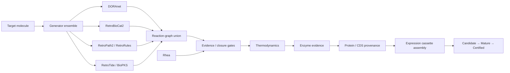

# SynBioCrow 2.1.1

[](https://doi.org/10.5281/zenodo.22999039)

**SynBioCrow** is a computational synthetic-biology design framework for moving from a target molecule to evidence-aware biosynthetic pathway candidates and provenance-backed DNA construct candidates.

**2.1.1 is the archival/repository-maintenance release.** It reorganizes and documents the repository for long-term use and Zenodo archiving. The underlying **scientific payload is unchanged from the sealed 2.1.0 release**.

> **Release status:** computational research release. Candidate pathways and constructs are **not experimental certifications**.

## What SynBioCrow does

SynBioCrow combines multiple complementary pathway-generation and evidence systems rather than relying on a single retrosynthesis engine.



The central design principle is that **generation and validation are separate**. A backend can propose chemistry, but it cannot promote its own output through the scientific lifecycle.

## Engine roles

| Component | Role in SynBioCrow 2.1 |
|---|---|
| **DORAnet** | General biosynthetic reaction-network generation |
| **RetroBioCat2** | Enzyme-centered biocatalytic retrosynthesis |
| **RetroPath2 / RetroRules** | Rule-based pathway generation and reaction-space expansion |
| **RetroTide** | Bounded specialized PKS design |
| **BioPKS** | PKS + post-PKS biological transformation workflow |
| **Rhea** | Reaction evidence / closure support — **not an independent generator** |
| **DORA-XGB** | Reaction-feasibility scoring within the BioPKS branch |
| **UniProt / RefSeq** | Protein and CDS provenance resolution |
| **iGEM Registry / SBOL resources** | Provenance-backed expression-part acquisition |

## Scientific lifecycle

**Candidate** — computationally generated route or construct satisfying the relevant structural/data contract.

**Mature** — Candidate that has passed stronger evidence gates such as reaction support, enzyme evidence, closure, and other required checks.

**Certified** — result satisfying the full certification contract for the release.

**SynBioCrow never promotes a result merely because a generator produced it or a model assigned it a high score.**

## Sealed scientific state

The 2.1 scientific release retains:

- **19 unique provenance-backed Candidate DNA constructs**
- **6 normalized BioPKS / RetroTide specialized-generator Candidate pathways**
- **0 specialized Mature pathways**
- **0 specialized Certified pathways**
- frozen **Paper-1 / v0.21** baseline
- preserved **benchmark-v2 blind-truth isolation**
- no fabricated chemistry, enzyme evidence, thermodynamics, or biological sequences

The leading bounded BioPKS candidate uses `rule0024_21`:

```text
O=C(O)C(O)Cc1ccccc1  →  O=C=O + OCCc1ccccc1
```

It remains **CANDIDATE / NOT_CERTIFIED** because direct independent reaction evidence, verified enzyme identity, and quantitative thermodynamics remain unresolved.

## Stable Python release API

```python
from synbiocrow import SynBioCrowRelease

release = SynBioCrowRelease(".")
print(release.status())
print(release.policies())
print(release.specialized_summary())
```

Install from the repository root:

```bash
pip install -e .
```

The lightweight `synbiocrow/` package is the stable release-state/API surface. Generator backends remain separate upstream scientific dependencies and are not vendored here.

## Repository layout

```text
SynBioCrow/
├── README.md
├── CITATION.cff
├── LICENSE.txt
├── pyproject.toml
├── RELEASE_NOTES.md
├── synbiocrow/                       # stable release API
├── docs/                             # architecture/API/limitations/reproducibility
├── release/
│   └── 2.1.0/                       # sealed scientific release manifests
└── development_history/
    ├── README.md
    ├── notebooks/                    # early notebook-era development
    └── scripts/                      # early supporting scripts
```

Formal releases are preserved by **Git tags + GitHub Releases + Zenodo**. The `development_history/` directory contains pre-release development lineage and historical artifacts, not current release files.

## Reproducibility

The sealed 2.1.0 scientific state is stored under [release/2.1.0](release/2.1.0/). The 2.1.1 repository update reorganizes those artifacts without changing their scientific content.

- [Reproducibility](docs/REPRODUCIBILITY.md)
- [Release manifest](release/2.1.0/release_manifest.json)
- [Integrated regression](release/2.1.0/integrated_regression.json)
- [Evidence abstention ledger](release/2.1.0/specialized_generator_abstention_ledger.json)

## Limitations

SynBioCrow 2.1 is a computational research system. It does **not** claim that a Candidate expresses successfully, has experimentally validated enzyme activity, produces useful flux, is nontoxic, is manufacturable, or is experimentally certified.

See [docs/LIMITATIONS.md](docs/LIMITATIONS.md).

## Citation

Please cite the archived repository release as:

**Heiman, Thomas J. (2026). SynBioCrow 2.1.1: computational synthetic-biology pathway and construct design framework. Zenodo. https://doi.org/10.5281/zenodo.22999039**

Machine-readable citation metadata is available in [CITATION.cff](CITATION.cff).

## DOI

**10.5281/zenodo.22999039**

https://doi.org/10.5281/zenodo.22999039
